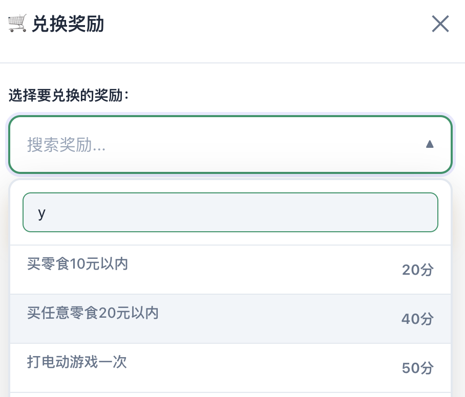

## 感受

我最近用 opencode 搭建了一个[完整的应用](http://kid.ethanhan.cc)。

整个过程中，我大部分的精力其实都在做3件事情。

- 像产品经理一样设计功能和交互
- 像测试人员一样验证产品的功能及交互
- 不停的发现bug，提出缺陷，然后跟AI一起配合修复问题

这么反复循环了几次之后，我最终意识到：AI极大地降低了**实现**的门槛，却成倍放大了**验证**的难度和重要性。

用AI进行编码，实现代码确实是唾手可得了，但是验证的过程却是没有办法省略的。

AI在进行逻辑实现的时候，如果需求描述的不是很明确，那么一些实现细节是一定会遗漏的，这点跟现存的软件开发是类似的。

需求缺乏细节，那么只有用反复的测试来弥补。

比如我要实现一个需求，大致描述一番之后，AI会给出它的实现思路，然后让我们进行选择。

我们任意选择一个选项之后，很多的细节其实是AI自己去把控的，功能看似可以完成，但不一定跟我们的初衷相符，所以要反复测试和修改才可以真正达到可用以及正确的状态。

这其实让我意识到: 生产力工具越强大，对质量把控的要求可能就要越高。

毕竟现在需求可以实现的很快，但是要又快又好，很多细节和问题都需要人类来进行测试验证以及兜底。

## AI时代的产品开发范式已经变了

传统的软件开发流程是这样的。

需求 → 设计 → 编码 → 测试 → 上线，根据Pressman教材数据，在经典软件工程里，测试环节通常占 20-30% 时间。

但是现在，编码环节被压缩到10-20%，但验证以及打磨环节占比飙升到50-70%。

JetBrains《2025开发者生态报告》显示：85%开发者定期用AI工具，62%依赖至少一个AI编码助手，但他们把更多时间花在“审查AI输出”和“调试AI生成代码”上（新增开销9-18%）。

我的看法是，如果多agent模式下的AI编码能力进一步提升，在一个项目团队里，产品和测试可能会比开发更为关键，毕竟编码的内容来自产品，编码的结果验证来源于测试。

在一个人一个团队的小型项目里，不会编码就能直接做应用的例子也逐渐习以为常，这一个人，大概率是更偏向于产品设计和测试。

市场的反馈其实也是这个趋势。

在中国市场，前程无忧《2026届校招AI人才需求报告》显示：AI测试工程师月薪中位数为13621元（虽低于核心算法岗的2.4-2.5万，但需求稳定增长，头部企业如阿里、腾讯、字节在AI质量方向扩招明显）。

这反映出：企业越来越愿意为“功能验证及质量控制”的能力买单。

## 为什么验证环节在AI时代变得更难、更重要？

### 第一个原因很容想到，那就是AI生成的代码充满概率性。

有数据称幻觉率（hallucination） 在复杂任务中可达 30-88%。

有时候AI觉得自己生成的东西没有问题，但真正上手测一下，就会发现一些隐藏的缺陷。

### 第二个原因是AI可以实现从“功能正确”， 但是“体验正确”却还需要反复的打磨。

AI很快做出“能跑”的东西，但“好用、防呆、边缘情况下不崩溃”的能力，还要靠人类来进行保证。

AI生成的代码往往停留在“表面能用”的层面：语法正确、逻辑基本通顺、基本路径走得通。但一到真实用户场景，就暴露出一堆“看起来小、实际致命”的体验问题。

这些坑AI自己很难感知，因为大模型缺乏真正的共情、上下文连续性和“好的人类体验”的直觉。

比如在我自己用 ai 实现的 kidcoins里，ai实现的兑奖下拉框原本是一个普通的`select`控件，用户体验不是很好。后面我自己上手之后给出了需要支持搜索的建议，反复修正之后，终于达到一个基本可用的用户体验。

### 第三个原因是系统复杂度后置到验证阶段

现代AI应用早已不是单一模型的简单调用，而是高度复合的“AI拼装系统”：RAG（Retrieval-Augmented Generation）+ 多模型组合 + Agent工作流 + 工具链 + 记忆模块 + 路由器。

单个模块“ok”并不等于整体“ok”——复杂度被后置到了验证阶段，这正是AI时代测试工程师最吃香的地方。

为什么复杂度后置？

因为这些系统本质上是“分布式概率计算”： LLM规划器输出意图 → RAG检索上下文 → 多模型并行推理 → 工具执行（如API调用、数据库操作） → 最终合成响应。

任何一环出现model drift（模型漂移）、data drift（数据漂移）、attention drift（注意力漂移）或agent drift（代理行为退化），都可能引发连锁灾难。

这些问题在设计阶段或者demo阶段是比较难暴露出来的，但是如果在真实数据的场景下长时间运行，则很有可能产生难以测试的缺陷。

拿一个典型的客服Agent工作流举例。

用户问“我的订单为什么还没到？”

LLM规划：意图识别 → RAG从知识库检索订单状态和物流规则 → 调用外部物流API查询实时位置 → 如果失败，fallback到人工。

但实际运行中可能出现： RAG检索到过时/噪声数据，导致幻觉回答“订单已签收”（实际未发货）；

多模型切换时上下文丢失，规划器突然“忘记”用户是VIP，路由到低优先级队列；

工具执行漂移：API调用超时，Agent无限重试导致系统卡死或资源耗尽；

长对话后出现agent drift（arXiv 2026论文《Agent Drift: Quantifying Behavioral Degradation》）：Agent在第10轮交互后行为退化，输出越来越偏离初始指令，甚至自相矛盾。

UC Berkeley 2025报告《Measuring Agents in Production》调研306个从业者和20个真实案例后指出：多Agent系统在demo中惊艳，但在生产环境中可靠性急剧下降，常见原因是“注意力漂移”（长上下文噪声积累）和“非确定性累积”。

Galileo 2025博客列出7大调试挑战，包括隐藏状态漂移和内存退化，这些问题AI自己很难自愈，需要资深的测试人员构造典型的测试数据和测试场景来进行验证。

一句话总结: AI把系统复杂度从“编码”后置到“验证”。谁能设计出覆盖漂移、幻觉、级联失败的测试策略，谁就能让“看起来很酷”的Agent真正上线赚钱。

## AI时代真正值钱的QA能力是什么？

### 质量策略设计的能力

用代码实现自动化用例的门槛越来越低，自动化程度越来越高，用例运行周期越来越短，但是测试数据的构建，测试环境的治理以及质量策略的设计还是要人工去介入，这种能力其实就是安身立命之本了。

### 具备硬通货技能

比如prompt测试、模型一致性、幻觉探测、RAG链路测试、智能体行为验证等。

### 数据思维

构造高质量评测集。比如TestFort建议就建议:30-40%项目时间用于幻觉测试与缓解，这些都需要测试数据来支撑。

### 风险评估

这个很容易理解了，什么必须测（底线case），什么可放过（优先级排序）,AI 可以自己评估自己，但总要有人为结果负责。

## 总结

个人觉得几年内测试应该是不会被AI所完全替代的，但是在AI的辅助下提升测试效率和自动化能力可能是大势所趋了。

所以别再焦虑‘测试会不会被AI取代’了。

真正该焦虑的是：我有没有跟上这个时代对‘验证能力’的新要求。

质量问题一直都会存在，但是不同的时代面临的问题可能不尽相同，拥抱变化总是比墨守成规要更加科学。

当然了，从2026年初各种skills的爆火我们也能感觉到，不久的将来，软件可能会出现两种形态。

一种软件是给人类来使用的，这种软件大概率是需要人类来进行验证和兜底的。

另一种软件是直接给AI使用的，比如最近文艺复兴的各种命令行工具 + markdown的说明问题，这些软件的质量保证工作可能未来真的可以由AI自主完成。不过随着调用链的深入以及场景的复杂性提升，人工介入的可能性也会越高，所以这种增量场景也是存在测试工程师发挥的空间的。

最后，**测试不会被 AI 取代，只是从「写用例和手工执行」升级成了「设计对抗概率的艺术」。**

