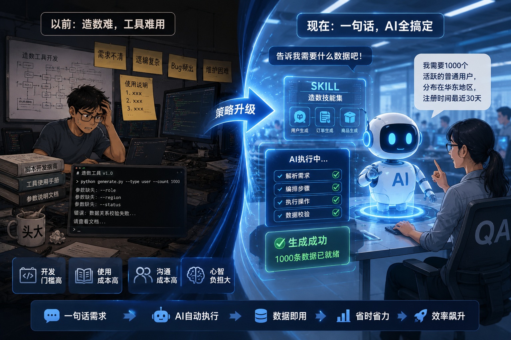
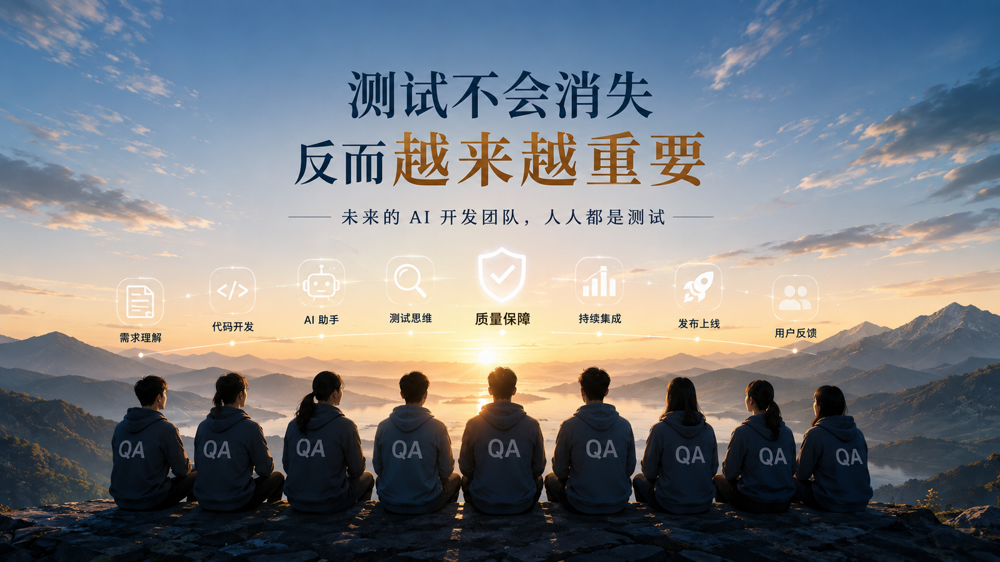

公司的AI提效进行了半年了，距离上一次总结和分享也过去快3个月了，是时候重新审视一下最近几个月的观察和实践了。

## 一些观察

- 提测质量降低。就目前的情况看来，在工程化程度一般的团队，使用AI进行高强度的代码开发之后，提测的质量看上去是降低了。比如提测之后发现需求做漏了，单位时间内测试发现的bug数变多了。我也思考了一下，在用AI写代码之后，由于单位时间产出的代码量有成倍的提升，所以一些开发基本上也不知道代码里到底干了些什么，自己只是做AI的操作员，不了解代码运行的逻辑和细节，一些之前自己写的时候会去详细拆解的细节点就这样被忽略掉了，bug变多就不足为奇了。另外产品经理现在也是用AI去写产品文档，开发在转代码的时候不会详细去看需求的细节，而是直接让AI去总结需求的内容，属于用魔法打败魔法。这种内容压缩的过程中细节丢失，最终可能导致代码没有实现需求中所有的要求。

- 测试团队扩大。AI提效之后我们测试团队人力增加了23%，但目前还是处于人力紧张的状态。这可能是因为AI让需求实现的周期缩短了，所以单位时间提测的需求变多了；另外提测质量降低了，测试周期不变的情况下，测试的工作量其实是提高了。

- 开发过度依赖AI导致需求返工。我们一个比较复杂的需求，由于各种各样的关系，开发过度依赖AI进行方案的设计和实现，最后在做code review的时候发现了很多严重的问题，最终导致需求返工重写，浪费了非常多的时间。这其实暴露了2个问题，第1就是在复杂问题的处理上，AI可能还有提升的空间；第2个问题其实比较普遍，开发人员过度相信AI，较少的进行自我思考，最终交付的产出物质量变低，存在相当大的风险。

- 测试人员写用例的门槛变得非常低。之前一个需求可能要写2天，现在一上午就搞定了。如果只是把需求内容直接丢给AI一把梭的话，可能几分钟就搞完了。这就可能导致一些需求，测试人员都没完整的看完和消化，测试用例就已经大而全的准备好了。所以我们现在对用例评审抓的比较紧，这是因为1，我们要在提测前最后对齐一次需求，沟通的成本不能省；2，强制让测试人员讲解用例，尽量保证大家都把需求读完了，弄明白了。

- 测试提效困难。AI可以很好的辅助测试用例的编写，但是在用例执行方面，还是有很多地方不能替代人工的。比如我们有个小项目，170条用例，AI可以自己执行大概50-60条，剩下的大头还是要人工去执行。而且AI执行的用例都比较简单，复杂一点的用例，比如去后台改个配置，然后再去观察用户同样操作下的另外一种表现，这些AI是没办法执行的。本质原因就是我们的用例里面没有给AI所有的必要信息，比如后台怎么操作，产品的所有细节等等，这就导致AI在业务知识以及技能储备方面不如专业测试，一些用例人类能看懂并且脑补的，AI没办法看懂，所以可执行的部分就十分有限了。而测试如果要提效，大头其实是在执行用例上面，目前看来能提效，但是覆盖面比较有限。

- 从发散思维到回归。我们这边测试全员都是要使用codex做一些提效相关的事情的，刚开始的1-2个月，我们鼓励每个测试人员把手头上需要重复去做的事情都想办法让codex去做，效果其实一般。后来我想了想，这是因为消除重复工作本质上是在开发工具，而开发工具比写业务代码要难，也比写自动化测试用例难，所以大家无从下手，这也是情有可原的。后面我改变了思路，先把框架搭好，然后让大家去根据业务场景补充自动化用例，把回归测试先做起来，这样方向限制住了之后，大家的参与度才慢慢的有了一些提升。

## 一些实践

- 测试用例评审前置。我们现在用AI做开发，遗漏需求细节基本变成了常态，所以我把研发流程稍微改了一下，需求评审完成之后直接用例评审，把测试用例作为研发过程中的输入，目前看来质量提升效果不明显。可能是因为开发为了提高吞吐量在需求评审之后就直接开干了，测试用例出来的时候功能都做完了，所以前置了个寂寞。

- 测试skill的全面使用。之前让我们这边的测试人员去开发一些造数的工具，用来提升数据准备的效率。后来发现工具写起来很困难不说，而且写好以后还要去跟使用者讲使用技巧，本身对使用者来说也是有心智负担的。最近我们改变了策略，直接把一些造数能力做成cli，然后封装成skill，测试人员只要告诉AI具体要什么样的数据，最后AI负责执行操作，编排步骤和核对结果。目前基本上这些skill每天都会用到，对测试效率的提升有着不错的正向效果。

- 回归用例的持续建设。测试工具不好写，但是回归用例用AI去写还是有可能的。之前我们陷入了一种误区，就是把所有的项目相关的上下文一股脑的丢给AI，让AI自己去写接口用例和UI用例，实际效果并不好。后来我们改变了策略，测试用例和断言都用自己语言去写，AI负责用代码去实现，这样用例的质量得到了巨大的提升，尽管人工参与的部分变多了，但是自动化用例的可掌控性实际上是变高了的，有信心的用例才是值得反复去执行的回归用例。

- 性能压测的工程化。在做后台压测的时候，对于一些稍微复杂一点的场景，数据准备往往是比较困难和费时的，特别是我们现在的团队偏年轻，大家没有相关经验，做起来更是举步维艰。后面我们尝试用AI去做压测数据的生成，测试人员负责构造测试场景，给出造数据的方案以及步骤，AI负责代码化和工程化，整个的性能测试流程变得顺畅了很多。其实压测数据的准备是有点难度的，拿我们之前压测的一个项目举例，我们需要用python去跑数据构造，用shell脚本去做场景编排和调用，最后用wrk实现测试脚本的时候还需要用到lua脚本，一个场景就需要用到3种不同的编程语言，这对测试人员的挑战很大，不过现在AI参与进来之后，这些流程定义的非常清楚的过程脚本的实现就非常简单，整体的测试效率得到了极大的提升。

- 千奇百怪的各种监控。我们有时候会收到一些奇怪的需求，比如要监控某个邮箱里的邮件，如果出现一些运营商或者应用市场发出的特定类型邮件就要进行告警。类似这样的监控，我们做了挺多的，AI实现起来又快又好，等于是节约了很多人工巡检以及打杂的时间，提升了项目的质量下限。

- 逆向应用进行接口测试。测试没有前后端的代码，而我们的前后端文档年久失修，不一定能反应当下应用的状态。所以我们通过AI去逆向前端和客户端应用，找到真正接口调用的方式和流程，配合请求抓包，拿到真实参数，最后用AI进行接口的编排和用例实现，把核心场景的接口调用都测试了一遍。因为是确定的代码，所以用例可以反复运行，配合ci/cd，就可以实现更加丰富的测试策略。

- Web及H5测试。我们发现一些特定类型的产品，在给出足够上下文，明确操作步骤，并在skill中定义好测试的方式方法时，基本上80%以上的用例都可以让AI自己跑。当然了，AI不能背锅，所以不管怎么样，人工介入还是必须的，但是如果只是冒烟或者并行测试提升测试效率的话，web和h5的测试确实可以外包相当大的一部分让AI代劳。

## 一些感触

- 完全交给AI写代码周，提测质量下降是个很显著的事实；
- 一些开发人员并不知道自己提交的代码细节，给他们提bug他们也改不了，最终还是要求助AI，久而久之这块代码就成了最熟悉的陌生人，可能会隐藏风险；
- 测试人员负载在变高；
- 测试开发的门槛在降低，自动化用例生成的门槛和成本已经非常低了，但是日常的维护还是需要较大的工作量；有经验的测试开发人员可以探索的空间变大，测试工程化还是有很大的潜力的；
- 纯手工的测试其实是有市场的，但是要学会用AI工具去提升测试效率；
- AI写的自动化用例必须人工review一下，因为AI可能偷懒，过度设计，前后矛盾，让简单的事情复杂化，编写完美主义的断言，哪怕在AGENTS.md中进行各种干预，久而久之代码还是有腐化的趋势；
- 讨论编程语言的意义已经不大了，根据应用场景选择语言就像是用不同的钥匙去打开不同的锁，就这么简单；
- 有经验的开发人员/测试人员的杠杆作用在放大，隐隐有老专家驱动开发的趋势了；年轻人现在不写代码了，成长的空间不足，如果只是AI操作员的话，年轻人是不如老专家那般可以自如面对疑难杂症的；
- 测试不会消失，反而越来越重要，可能以后的AI开发团队，人人都是测试；

