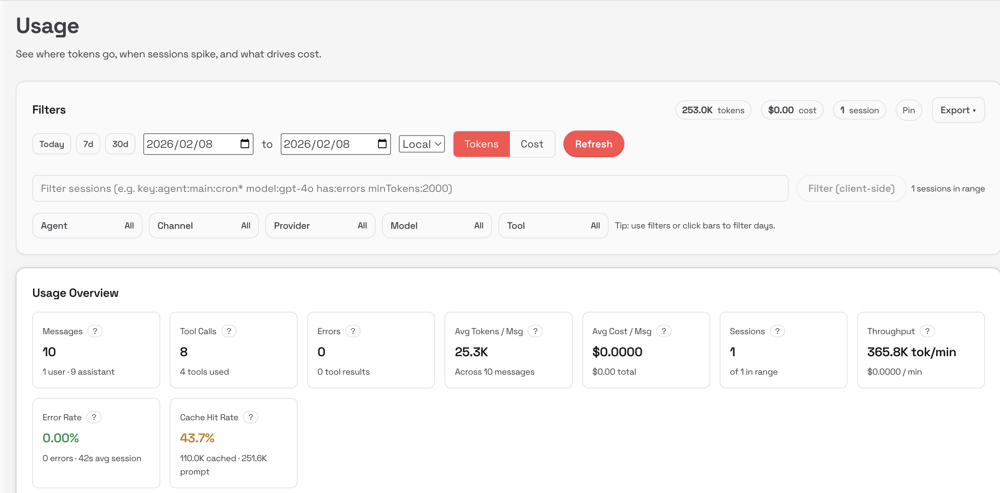
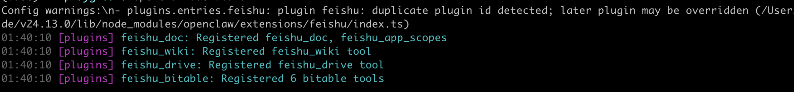
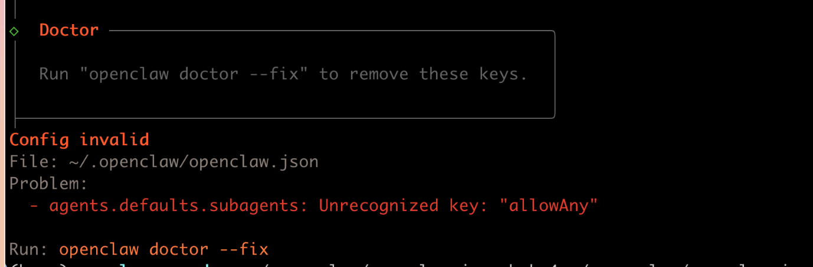

openclaw的版本发布速度非常快，这几天基本上是一天一个版本。

最近的几个版本里值得一提的更新有：

- 首次官方添加飞书/国际版 Lark 插件，有完整文档。官方终于出手了，不用自己装插件了
- 新增 Agents 仪表盘：可视化管理多个 Agent 的文件、工具、技能、模型、channels、Cron 任务等。极大方便多 Agent 用户切换、调试、配置。这个我不太会玩，没感觉很方便
- 记忆后端优化：可选启用 QMD backend 用于 workspace memory的搜索，技术细节不展开讲了，简单来说就是这个可以省token
- 用户体验提升：中文文档爆炸式完善以及Web UI 强化，非开发者也能更容易上手，这个就见仁见智了
- 增加了用量页面，可以看到token的消耗了，终于知道钱花到哪里去了



## 升级

既然有新版本那就跟着升级吧。

用[官方推荐](https://docs.openclaw.ai/zh-CN/install/updating)的方式升级，命令行里运行一下这个命令。

```
curl -fsSL https://openclaw.ai/install.sh | bash
```

这次升级之后可能会报飞书插件的错误，可以忽略。

我手贱试着让openclaw自己去fix这个错误，结果导致配置文件出错，openclaw直接挂掉了，所以这个错误就先放一边吧。



## 如何快速恢复openclaw

openclaw的新版本增加了Agent的仪表盘功能，每个agent的状态现在一目了然。

我试着在聊天窗口里让openclaw自己去添加1个agent，openclaw自己跑着跑着，又把自己跑挂了。

是的，它自己把自己的配置文件给改挂了。

一天之内轻松完成了配置错误的帽子戏法，确实有点无语。



好在openclaw有个隐藏的快速恢复机制，我们可以用下面的命令快速让它满血复活。

```
cp ~/.openclaw/openclaw.json.bak.4 ~/.openclaw/openclaw.json
```

` ~/.openclaw/`这个文件下面可能会有多个.bak文件，把最新的那个覆盖主配置文件`~/.openclaw/openclaw.json`就好了。

之后就是重启gateway。

我发现遇到疑难杂症的时候就去重启gateway一下，也许问题就莫名其妙的解决了。

```
openclaw gateway restart

```

## 直接归零

如果没有备份文件的话，也不要着急，用下面的命令去重新恢复出厂设置也可以。

```
openclaw reset
```

这时候有3个选项，按照实际情况来选择就好了。

```
| ○ Config only
│ ● Config + credentials + sessions (keeps workspace + auth profiles)
│ ○ Full reset
```

## 总结

折腾了半天，发现只要记住两点就好了。

- 第一点就是大胆去尝试，配置尽可能让openclaw自己改，openclaw的配置很复杂，自己改更容易改出问题。另外好像每次修改之前，openclaw会自己备份一下配置文件。改挂了恢复一下就好了;
- 遇事不决就重启gateway，也许能歪打正着，解决一些摸不着头脑的问题;

另外现阶段openclaw还是不适合没有开发经验的同学，大家不用频繁的去追最新的版本，稳定跑起来才是第一生产力。
