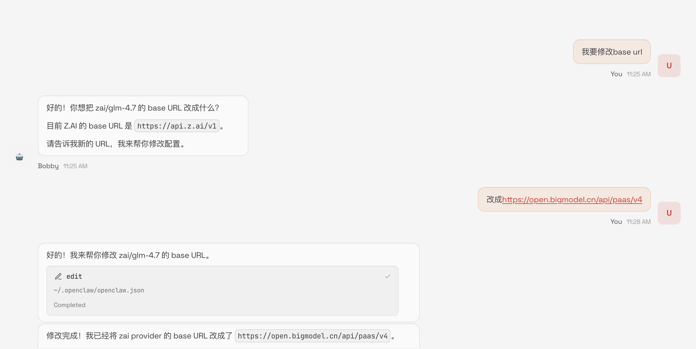

我的openclaw用的是智谱的模型。

据说默认情况下openclaw调用的是国际版的api，所以国内的同学最好是修改成中国版本的api地址。

<!--more-->

### 手动修改

先来看一下怎么手动修改。

其实比较简单，直接修改`~/.openclaw/openclaw.json`这个文件就可以了。

在`models`里加入下面的配置。

```json
  "models": {
    "providers": {
      "zai": {
        "baseUrl": "https://open.bigmodel.cn/api/paas/v4",
        "apiKey": "zai",
        "api": "openai-completions",
        "models": [
          {
            "id": "glm-4.7",
            "name": "GLM-4.7",
            "reasoning": false,
            "input": [
              "text"
            ],
            "cost": {
              "input": 0,
              "output": 0,
              "cacheRead": 0,
              "cacheWrite": 0
            },
            "contextWindow": 200000,
            "maxTokens": 8192
          }
        ]
      }
    }
  },

```

然后再重启gatway。

```
openclaw gateway restart
```

### 自动修改

也可以让openclaw自己改，不过时灵时不灵的。



### 验证

用下面的命令验证一下是不是流量都过去了。

如果能看到持续输出，就证明配置成功了。

```
sudo tcpdump -i any -A host open.bigmodel.cn
```
