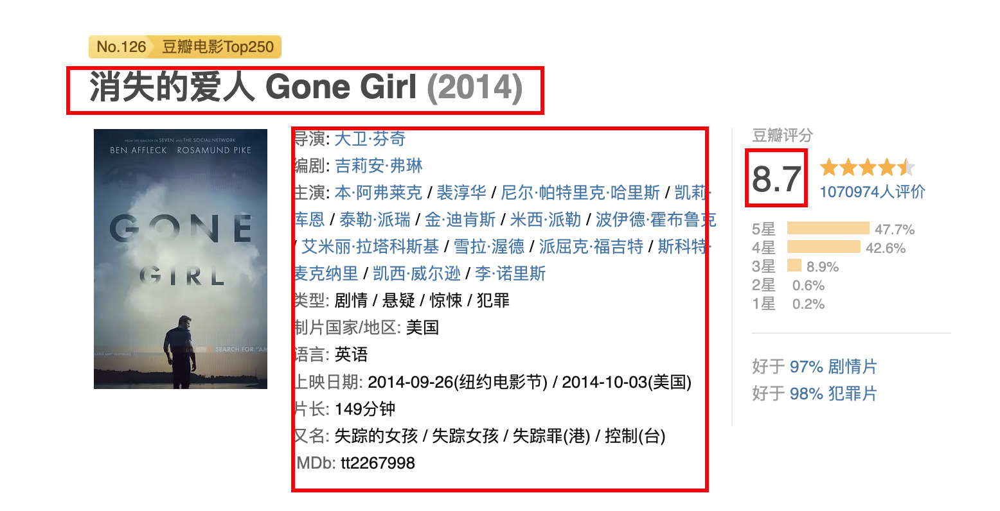
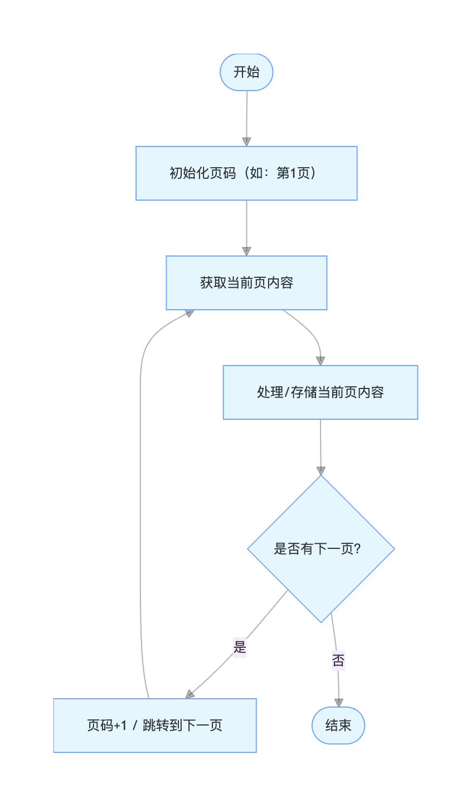

Scrapling应该是当下最强的爬虫工具了，关于它的特性和反爬能力这里就不赘述了，大家可以去[项目主页](https://github.com/D4Vinci/Scrapling)了解一下。

Scrapling 提供了一套从单页请求到全站爬取、从普通站点到Cloudflare防护站点的较为完整的现代爬虫解决方案，尤其适合需要较高隐蔽性但对速度要求不是极致的场景。

## 实战1: 使用Stealthy Fecher来获取豆瓣电影的详情

第一个例子是使用[Stealthy Fecher](https://scrapling.readthedocs.io/en/latest/fetching/stealthy.html)来获取豆瓣电影的详情。

豆瓣电影的详情页如果直接访问的话会有一次javascript的跳转，所以必须用打开浏览器的方式去爬，这也是Stealthy Fecher的使用场景。



Stealthy Fecher会用浏览器打开目标站点的地址，并且自动绕过一些通用的反爬限制。

具体代码如下，就是使用浏览器打开豆瓣电影的详情页，然后从页面上提取出具体的数据。

```python
"""
示例目标：从豆瓣电影页面提取以下核心信息
- 电影中文名
- 上映年份
- 豆瓣评分
- IMDb id
- 前几条热门短评

使用的技术特点：
1. 使用 StealthyFetcher 而非普通 requests（带真实浏览器指纹）
2. 等待关键元素 #info 加载完成（豆瓣很多数据是 js 渲染的）
3. 使用 css 选择器 + 简单正则进行字段提取
4. 对可能为空的字段做了简单容错处理
"""
# 导入 StealthyFetcher 类，用于模拟真实浏览器行为来获取网页内容
# （相比普通 requests 更能绕过部分反爬机制）
from scrapling.fetchers import StealthyFetcher

# 目标网页：豆瓣电影的详情页面
url = 'https://movie.douban.com/subject/1296736'

# 使用 StealthyFetcher 进行网页获取（模拟真实浏览器访问）
page = StealthyFetcher.fetch(
    url,                    # 要抓取的目标URL
    google_search=False,    # 对于国内的站点，不使用 Google 搜索跳转（直接访问）
    real_chrome=True,       # 尽量使用真实的 Chrome 浏览器指纹（更像真人）
    wait_selector='#info'   # 等待页面中 id="info" 的元素加载出来再返回（重要！）
                            # 防止过早返回导致关键信息还没加载
)

# 从 div#info 块中提取 IMDb id（通常是 tt 开头的8位数字）
# 写法：先选 #info → 取整个文本内容 → 清理 → 用正则匹配 tt 开头的数字
imdb = page.css('#info').get().clean().re_first(r'(tt\d{5,8})')

# 提取电影标题（h1 标签下面的 span 文本）
title = page.css('h1 span::text').get()

# 提取年份（h1 里带 class="year" 的 span，通常是 (1993) 这种格式）
# 再用正则只保留数字部分
year = page.css('h1 span.year::text').get().clean().re_first(r'(\d+)')

# 提取评分（class 为 rating_num 的元素文本，通常是 9.3 这种）
# 直接转为 float 类型
rating = float(page.css('.rating_num::text').get())

# 提取所有短评（class 为 short 的 span 标签的文本内容）
# getall() 返回列表
shorts = page.css('span.short::text').getall()

# 将年份字符串安全转为整数，如果不存在则为 None
year_int = int(year) if year else None

# ──────────────── 输出结果 ────────────────
print("提取到数据：")
print(title, year_int, rating, imdb)

print("短评前3条：", shorts[:3])

```

上面代码的核心是` page = StealthyFetcher.fetch( url, google_search=False, real_chrome=True, wait_selector='#info')`，因为页面打开之后会有个自动的javascript跳转，所以我们要等待跳转结束并且页面上的元素加载成功之后才进行操作，这也就是`wait_selector='#info`的作用。

`wait_selector='#info`表示等待页面上的`div#info`元素出现之后再进行数据的抓取。

这是做爬虫时的常用技术，可以极大的提升爬虫的稳定性。

如果需要爬**单个页面**或者**有限的几个页面**的内容，直接使用Scraptling的[Fecher](https://scrapling.readthedocs.io/en/latest/fetching/choosing.html)就好了。

如果页面上有javascript动态渲染的内容，就用[DynamicFetcher](https://scrapling.readthedocs.io/en/latest/fetching/dynamic.html)和[StealthyFetcher](https://scrapling.readthedocs.io/en/latest/fetching/stealthy.html)，否则就用普通的[Fetcher](https://scrapling.readthedocs.io/en/latest/fetching/static.html)。

## 实战2: 使用Spider来爬取整站或者多个页面的内容

如果我们要把整个站点的内容，或者多个页面的内容都爬下来，那么用Fecher就有点吃力了。

这时候就需要使用[Spider](https://scrapling.readthedocs.io/en/latest/spiders/architecture.html)。

具体例子，如果我要从豆瓣获取250部评分最高的经典电影，也就是[这个页面](https://movie.douban.com/top250)里的内容，那么我们的思路一般如下。



如果用Feacher写的话，就稍微有一点点麻烦，特别是加上并发处理的话，那么工作量还是可观的。

这时候我们可以用Scrapling的Spider能力。

Spider其实给我们写成建制的爬虫提供了一个很好的框架能力。

下面就是如何用10个并发去抓取并保存豆瓣top 250电影的代码。

```python

# 导入必要的模块
from scrapling import Selector          # 用于处理HTML片段的轻量级选择器
from scrapling.spiders import Spider, Response  # 爬虫框架的核心类

# 定义一个爬虫类，继承自Spider
class MovieSpider(Spider):
    # 爬虫的名字（唯一标识）
    name = "douban_movie_250"

    # 起始URL列表，爬虫从这里开始
    start_urls = ["https://movie.douban.com/top250"]

    # 并发请求数（同时最多发送多少个请求）
    concurrent_requests = 10

    # 解析函数：每收到一个页面响应都会调用此方法
    # response 参数包含了下载下来的页面内容及相关信息
    async def parse(self, response: Response):
        """
        解析豆瓣Top250电影列表页面
        提取每部电影的基本信息，并处理翻页
        """

        # 遍历当前页面中所有的电影条目（每个li代表一部电影）
        for movie in response.css(".grid_view li"):

            # 提取电影信息段落（导演 / 主演 / 年份 / 地区 / 类型）
            # .get() 获取第一个匹配的html字符串
            info_div = movie.css(".bd > p").get().replace("<br>", "")

            # 把提取出来的html片段再用Selector处理，方便后续清洗
            s = Selector(info_div)

            # 提取所有文本并进行基本的清理（去除多余空格、换行等）
            info = s.get_all_text().clean()

            # 构建要保存的每部电影的数据字典
            yield {
                "title":  movie.css('.title::text').get(""),           # 中文片名
                "rating": movie.css(".rating_num::text").get(""),      # 评分（字符串，如 "9.6"）
                "info":   info,                                        # 导演/主演/年份/地区/类型 等信息
                "quote":  movie.css(".quote > span::text").get(""),    # 一句话经典台词/影评
            }

        # 查找“下一页”按钮
        next_page = response.css("span.next a")

        # 调试用：打印一下找到的下一页元素（生产环境可删除）
        print(next_page)

        # 如果存在下一页链接，就继续请求下一页
        # 使用 response.follow() 方法自动处理相对/绝对URL
        if next_page:
            # next_page.first.attrib['href'] 获取第一个<a>标签的href属性
            yield response.follow(
                next_page.first.attrib['href'],
                callback=self.parse     # 下一页仍然使用同一个parse方法处理
            )


# 启动爬虫并获取结果
# start() 方法会阻塞直到爬取完成
result = MovieSpider().start()

# 打印爬取到的条目数量
print(f"Scraped {len(result.items)} quotes")

# 将结果保存为JSON文件
# indent=True 表示格式化输出（带缩进，便于阅读）
result.items.to_json("douban_250.json", indent=True)
```

Spider 其实提供了一个范式：**“定义 → 提取 → 产出 → 跟随”** 的闭环流程。

绝大多数常规爬虫的需求，都可以很好地套用这个四步结构：

1. **定义**（start_urls / 初始请求 / headers / cookies / meta 等）  
   → 告诉框架“我要从哪里开始，以及用什么身份去访问”

2. **提取**（parse / parse\_\* 方法里的 css / xpath / 正则 / json解析 等）  
    → 从响应里“抠”出两类东西：  
   　　- 结构化数据（yield dict / Item）  
   　　- 下一批要爬的链接（yield Request）

3. **产出**（yield 的两种主要形式）
   - yield {…} / yield Item → 数据进入 item pipeline
   - yield Request(url, callback=xxx) → 触发新的下载 → 新的响应 → 新的 parse 调用

4. **跟随**（follow / follow_all / Request(callback=…)）  
   → 把“下一页”“详情页”“翻页参数变化”“ajax 下一页”等自然地串联起来，形成完整爬取链路

所以你会发现，绝大多数写得比较规范的 [scrapy](https://www.scrapy.org/)(Scrapling的Spider写法就是致敬scrapy的)/Scrapling 项目，最后核心逻辑其实就浓缩在 1～3 个 parse 方法里。

## 实战3: 使用StealthyFetcher 绕过cloudflare的反爬机制

现在很多站点都有cloudflare的保护，在访问之前都会检查是否是真人访问，这对爬虫来说是致命的打击。

好在Scrapling内置了解决cloudflare验证的能力，而且用起来十分的简单。

```python
from scrapling import StealthyFetcher

url = "https://medium.com/@hurkantuna/development-got-10x-faster-testing-didnt-4fd4c86cbd17"

page = StealthyFetcher.fetch(url=url, google_search=False, real_chrome=True, solve_cloudflare=True)

print(page.css("article").first.get_all_text())

```

一共就2个地方需要注意的。

- 要用StealthyFetcher
- 在 fetch() 的时候添加`solve_cloudflare=True`这个参数

我验证了一下，确实是可以绕过cloudflare的，不过速度就比较慢了，从日志上看，打开一个页面要2分钟以上，大家可以看一下下面的日志，体会一下反爬对抗的激烈程度。

```
[2026-03-06 15:42:01] INFO: The turnstile version discovered is "managed"
[2026-03-06 15:42:14] INFO: Cloudflare page didn't disappear after 10s, continuing...
[2026-03-06 15:42:14] INFO: Looks like Cloudflare captcha is still present, solving again
[2026-03-06 15:42:14] INFO: The turnstile version discovered is "managed"
[2026-03-06 15:42:25] INFO: Cloudflare page didn't disappear after 10s, continuing...
[2026-03-06 15:42:25] INFO: Looks like Cloudflare captcha is still present, solving again
[2026-03-06 15:42:25] INFO: The turnstile version discovered is "managed"
[2026-03-06 15:42:36] INFO: Cloudflare page didn't disappear after 10s, continuing...
[2026-03-06 15:42:36] INFO: Looks like Cloudflare captcha is still present, solving again
[2026-03-06 15:42:36] INFO: The turnstile version discovered is "managed"
[2026-03-06 15:42:47] INFO: Cloudflare page didn't disappear after 10s, continuing...
[2026-03-06 15:42:47] INFO: Looks like Cloudflare captcha is still present, solving again
[2026-03-06 15:42:47] INFO: The turnstile version discovered is "managed"
[2026-03-06 15:42:58] INFO: Cloudflare page didn't disappear after 10s, continuing...
[2026-03-06 15:42:58] INFO: Looks like Cloudflare captcha is still present, solving again
[2026-03-06 15:42:58] INFO: The turnstile version discovered is "managed"
[2026-03-06 15:43:09] INFO: Cloudflare page didn't disappear after 10s, continuing...
[2026-03-06 15:43:09] INFO: Looks like Cloudflare captcha is still present, solving again
[2026-03-06 15:43:09] INFO: The turnstile version discovered is "managed"
[2026-03-06 15:43:20] INFO: Cloudflare page didn't disappear after 10s, continuing...
[2026-03-06 15:43:20] INFO: Looks like Cloudflare captcha is still present, solving again
[2026-03-06 15:43:20] INFO: The turnstile version discovered is "managed"
[2026-03-06 15:43:31] INFO: Cloudflare page didn't disappear after 10s, continuing...
[2026-03-06 15:43:31] INFO: Looks like Cloudflare captcha is still present, solving again
[2026-03-06 15:43:32] INFO: The turnstile version discovered is "managed"
[2026-03-06 15:43:43] INFO: Cloudflare page didn't disappear after 10s, continuing...
[2026-03-06 15:43:43] INFO: Looks like Cloudflare captcha is still present, solving again
[2026-03-06 15:43:43] INFO: The turnstile version discovered is "managed"
[2026-03-06 15:43:54] INFO: Cloudflare page didn't disappear after 10s, continuing...
[2026-03-06 15:43:54] INFO: Looks like Cloudflare captcha is still present, solving again
[2026-03-06 15:43:54] INFO: The turnstile version discovered is "managed"
[2026-03-06 15:44:05] INFO: Cloudflare page didn't disappear after 10s, continuing...
[2026-03-06 15:44:05] INFO: Looks like Cloudflare captcha is still present, solving again
[2026-03-06 15:44:05] INFO: The turnstile version discovered is "managed"
[2026-03-06 15:44:43] INFO: Cloudflare captcha is solved
[2026-03-06 15:44:43] INFO: Fetched (307) <GET https://medium.com/...
[2026-03-06 15:44:43] INFO: Fetched (200) <GET https://medium.com/...
```

实战3的日志大家也看到了，Cloudflare现在真的是“卷”到极致了，反复轮询Turnstile十几次才勉强过，单个页面要花2分钟+，这才是2026年反爬对抗的真实写照。

但好消息是：Scrapling至少给你提供了一个解决方案，而且是**目前开源社区里最开箱即用的一条路**。不用自己去魔改Playwright、不用接三方接码、不用天天维护指纹库，`solve_cloudflare=True` 一行参数就可以无脑搞定，成功率目前看来是可以接收的。

## 与openclaw结合

openclaw上已经有不少skills包装了scrapling的能力。

大家可以去[clawhub](https://clawhub.ai/skills?sort=downloads&q=scrapling)上搜索和安装。

## 最后几点实战建议

- **Fetcher 优先级选择**：  
  普通静态网站: Fetcher / AsyncFetcher  
  JS渲染但不强反爬的站点: DynamicFetcher  
  任何有跳转/指纹/Cloudflare的网站: StealthyFetcher

- **大规模任务别只靠Stealthy**：  
  StealthyFetcher适合突破关卡，但真要日爬几万页，建议用它先“探路”， 拿到cookie/session之后切换到轻量级的AsyncFetcher + 复用身份去跑主流程，也许能把速度拉回正常水平。

- **法律&道德红线**：  
  工具再强，也请遵守robots.txt。Scrapling是为了让数据获取更简单，不是为了某些别有用心的目的。

### 结语

爬虫之路，道阻且长，Scrapling在目前可能是一个比较合适的选择。
