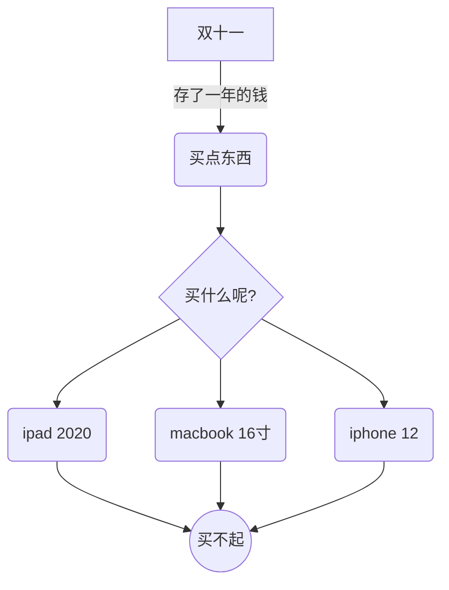
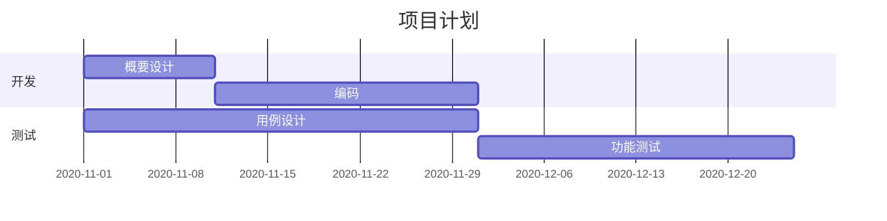
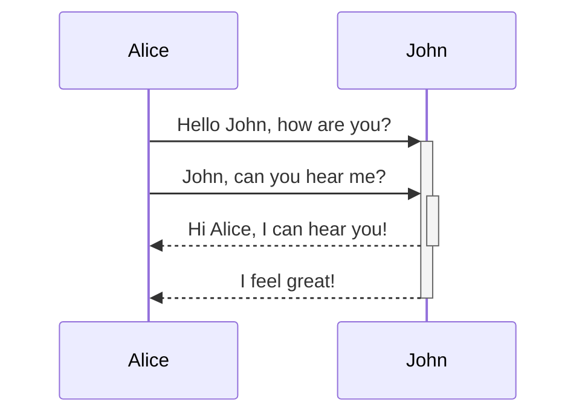
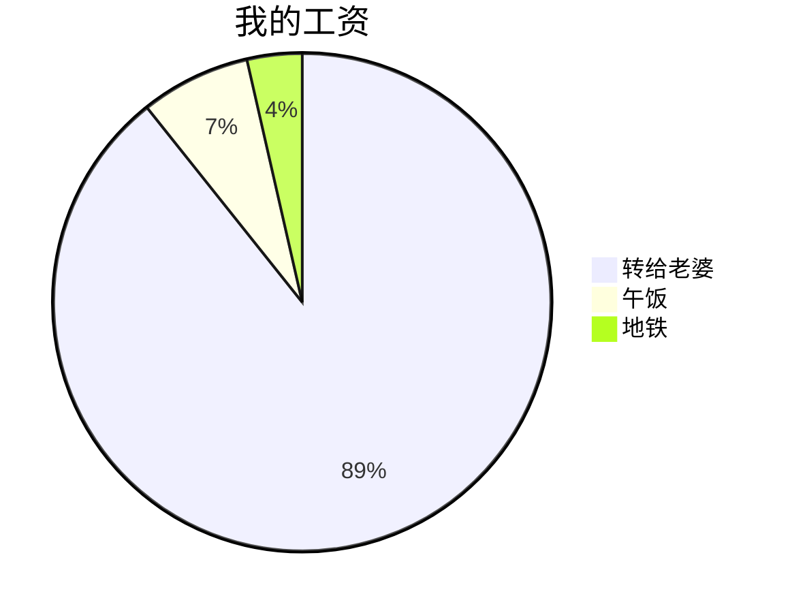

markdown现在的扩展性越来越强，也玩出了更多花样。

我们可以使用marp来实现用markdown写ppt的功能，最近我又发现了令一款好玩的工具。

那就是用markdown来画流程图/甘特图/类图/实体图/饼图/各种图的工具mermaid。

该项目在github上开源，地址是https://github.com/mermaid-js/mermaid。

### 基本使用

mermaid的使用场景有

* 作为一个js库在任何网页上使用，我们可以使用mermaid API来动态把markdown文本渲染成svg图片；
* 跟主流编辑器结合，在编辑器上实现一边写markdown代码一边实时预览的功能；
* 在gitlab等工具上实现使用markdown画流程图的功能；
* 跟主流的blog以及cms系统结合，实现用markdown画图的功能；
* 在命令行实现把markdown文本转换成svg图片的功能；
* 实现一个渲染server，通过请求发送markdown文本，然后server返回渲染好的图片
* ......还有更多场景就不列举了

这里我用的最多的场景是用vscode/atom来写markdown文本，然后实时预览流程图，最后把图直接截出来，保存或者到处贴，这样就能让我的大部分文档工作都使用同一个工具(vscode/atom)完成，这样就不需要安装各种工具了或者在各个工具之间反复横跳了。

另外纯文本也非常适合直接保存在代码库里，方便多端多机器同步以及协作。

### 具体的例子

#### 流程图的例子


上面的流程图渲染出来是这个样子的，比较简单，不过也有一定的配置能力，适用于一些相对标准的场景

-----------

#### 甘特图的例子

画甘特图一般都是要装第三方工具的，mermaid可以覆盖一部分的使用场景，有一些实用性



具体效果如下。


-------------

#### 时序图的例子



简洁明了，没有问题。

---------------

#### 饼图



### 总结

总的来说，这款工具还是比较符合我的使用习惯的，推荐有兴趣的小伙伴可以简单尝试一下。

### One more thing

在很多时候，我们其实是有使用脑图的需求的，如果可以用markdown画脑图，那体验的一致性应该是极好的。

其实是可以的，简单搜索了一下```markmap.js```可以完成这个功能，不过似乎不支持vscode的实时预览，这无疑给实用性打了一定的折扣。

不过在线的编辑器体验还是不错的，可以作为画脑图的另一个选项。

编辑器地址：https://markmap.js.org/repl


原始封面


